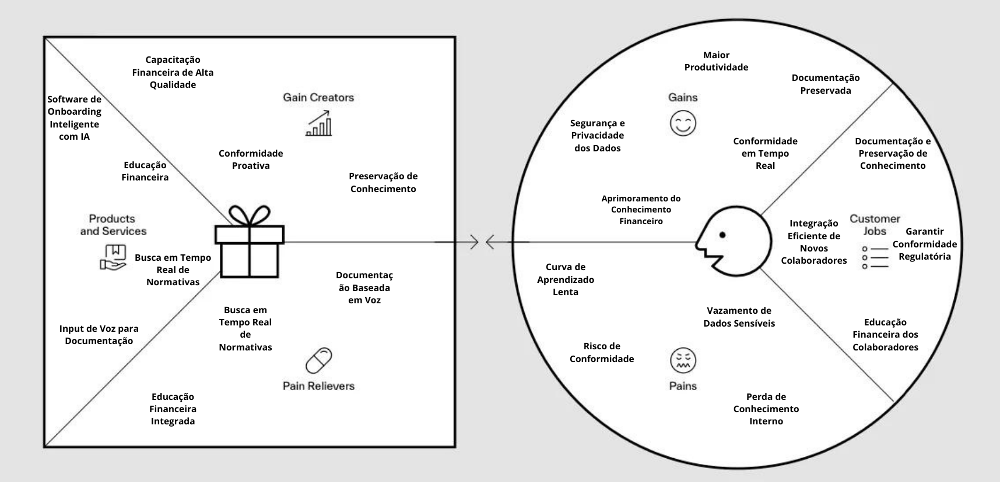

# Chameleon

🧠 A solução consiste em um chatbot capaz de capacitar o conhecimento de mercado financeiro entre os colaboradores de uma iinstituição bancária de forma personalizada.

⚙️ Solução desenvolvida usando ReactJS, Python...[COLOCAR O RESTANTE]

## Índice

- 🌐[Cenário Geral](#cenário-geral): Uma perspectiva das altas tranformações que o mercado de trabalho sofreu nas últimas décadas.
- 🎯[Nossa Ideia](#nossa-ideia): A partir da perspectiva geral, como pretendemos promover a educação financeira entre os colaboradores de uma instituição bancária.
- 📈[Análise de Mercado](#análise-de-mercado): Entendendo a falta de conhecimento financeiro por pessoas que ingressam em uma instituição bancárias e como podemos proporcionar o conhecimento técnico financeiro dos colaboradores
- 💻[Detalhamento de Tecnologias](#detalhamento-de-tecnologias): Uma visão mais aprofundada das tecnologias utilizadas no desenvolvimento do projeto.
- 📍[Planos Futuros](#planos-futuros): Uma prospecção de como podemos melhorar a nossa proposta.
- 😀[Nossa Equipe](#nossa-equipe): Conheça os nossos membros.

## 🌐Cenário Geral

O mercado de trabalho atual, especialmente no setor de tecnologia, está passando por uma transformação significativa, marcada por uma alta turnover(rotatividade de colaboradores) de colaboradores. Em um ambiente onde a demanda por profissionais qualificados supera a oferta, empresas de todos os setores, incluindo o mercado financeiro, enfrentam o desafio de atrair e reter talentos. A rápida mudança de emprego por parte desses profissionais, que frequentemente buscam melhores oportunidades, resulta em períodos curtos de permanência nas empresas, criando uma dinâmica desafiadora para a continuidade e o sucesso dos projetos.

No setor de tecnologia, a rotatividade de colaboradores tornou-se uma realidade constante. Profissionais da área tech são altamente valorizados e, devido à escassez de talentos, têm à sua disposição diversas oportunidades de emprego, muitas vezes com propostas mais atraentes em termos de remuneração, benefícios e flexibilidade. Essa competição acirrada entre as empresas faz com que os profissionais mudem de emprego com mais frequência, o que, por sua vez, impacta diretamente a estabilidade das equipes e o andamento dos projetos.

No mercado financeiro, onde a precisão, a conformidade com regulamentações e a segurança da informação são fundamentais, a alta rotatividade na área tech pode ter consequências ainda mais significativas. Projetos críticos, que exigem um profundo entendimento dos processos internos, dos termos financeiros e das normativas regulatórias, podem ser prejudicados pela constante entrada e saída de colaboradores. Além disso, a necessidade de integrar rapidamente novos membros às equipes e garantir que eles compreendam o contexto e os objetivos dos projetos em andamento torna o processo de onboarding ainda mais crucial.

Um aspecto frequentemente negligenciado, mas vital, é a **educação financeira dos colaboradores**. Muitos profissionais, especialmente aqueles que não vêm de uma formação financeira, ingressam no mercado financeiro sem o conhecimento necessário para compreender plenamente os produtos e serviços que promovem, os riscos associados ou as regulamentações que precisam seguir. Sem uma educação financeira adequada durante o onboarding, esses colaboradores podem enfrentar dificuldades significativas, comprometendo sua eficiência e aumentando o risco de erros operacionais.

A falta de **educação financeira** não afeta apenas áreas operacionais e de compliance, mas também impacta a **employee experience**. Colaboradores que não entendem os fundamentos financeiros podem se sentir inseguros em suas funções, o que diminui a satisfação no trabalho e pode contribuir para uma maior rotatividade. Além disso, áreas como marketing e vendas também são afetadas. Profissionais de marketing precisam compreender os produtos financeiros que promovem, bem como as regulamentações que governam a comunicação dessas ofertas. Sem essa compreensão, campanhas podem ser mal direcionadas ou até mesmo não conformes com as normas regulatórias.

Por fim, o mercado financeiro está sujeito a constantes atualizações e mudanças nas regulamentações, frequentemente impostas por normativas de órgãos como o Banco Central. A capacidade de manter os colaboradores informados e em conformidade com as últimas normativas é essencial para evitar penalidades e garantir a segurança das operações. Nesse contexto, soluções de onboarding que não apenas integram novos colaboradores, mas também fornecem **educação financeira** e acesso em tempo real às regulamentações mais recentes são fundamentais.

Este cenário de alta rotatividade, constante mudança de equipes e evolução regulatória coloca uma pressão adicional sobre as empresas para que revisem e aprimorem seus processos de integração. Sem um onboarding eficiente e atualizado, que inclua a educação financeira, os novos colaboradores podem levar mais tempo para se adaptar, comprometendo a produtividade, a conformidade e a **employee experience** em diversas áreas da empresa. Em um mercado tão dinâmico e competitivo como o financeiro, a capacidade de integrar, educar e reter talentos de forma eficaz, enquanto se mantém em conformidade com as regulamentações mais recentes, é muito importante para o sucesso a longo prazo.
## 🎯Nossa ideia
## O problema

No mercado financeiro, onde a complexidade e a regulamentação são fundamentais, a integração eficaz de novos colaboradores é um desafio crítico. Muitos profissionais, especialmente aqueles que ingressam na área sem uma formação sólida em finanças, enfrentam dificuldades significativas para entender os produtos financeiros, as regulamentações e os processos internos. Essa falta de preparo não só retarda a adaptação dos novos colaboradores, mas também aumenta o risco de erros operacionais e falhas na conformidade regulatória.

Além disso, a alta rotatividade na área de tecnologia intensifica esses desafios, já que novos colaboradores precisam ser integrados rapidamente em projetos críticos, muitas vezes sem o conhecimento necessário para compreender plenamente o ambiente financeiro. Sem um processo de onboarding que aborde essas lacunas, a produtividade é comprometida e a conformidade com as regulamentações torna-se uma preocupação constante.

Outro aspecto crítico é a necessidade de manter os colaboradores atualizados com as frequentes mudanças nas normativas do setor financeiro. As regulamentações impostas por órgãos como o Banco Central são complexas e estão em constante evolução. Sem uma forma eficiente de acessar e entender essas normativas em tempo real, os colaboradores podem inadvertidamente operar fora de conformidade, colocando a instituição em risco.

Portanto, o problema central é a falta de um processo de onboarding que não apenas integre novos colaboradores, mas também forneça educação financeira e acesso atualizado às normativas relevantes. Resolver esse problema é essencial para garantir que os colaboradores sejam produtivos, conformes com as regulamentações e capazes de contribuir efetivamente para o sucesso contínuo das operações financeiras.

## A solução

A solução que está sendo desenvolvida é um software inovador voltado para a educação financeira dos colaboradores no setor bancário, oferecendo um conjunto abrangente de funcionalidades que atendem às necessidades críticas de educação econômica, conformidade com normativas do Banco Central, documentação e onboarding de colaboradores recentes.

- **1. Conformidade com Normativas e Atualizações do Mercado:**
O software oferece uma capacidade única de realizar buscas em tempo real das normativas do Banco Central, assegurando que os colaboradores estejam sempre atualizados com as mais recentes regulamentações de compliance. Além disso, ele captura e apresenta normativas e tendências que o mercado está lançando, fornecendo aos colaboradores as informações necessárias para agregar mais valor à empresa e garantir que as operações estejam sempre em conformidade com os padrões regulatórios mais atuais.

- **2. Educação Financeira para Colaboradores:**
O principal pilar desta solução é a educação financeira dos colaboradores. O chatbot possui a capacidade de saciar dúvidas desde conceitos financeiros básicos até tópicos mais avançados e personalizados de acordo com os serviços e produtos oferecidos pela a empresa contratante, permitindo que todos os funcionários, independentemente de sua formação prévia, compreendam os produtos financeiros, as regulamentações e os riscos associados às suas funções. Essa abordagem melhora a confiança e a eficácia dos colaboradores, reduzindo a curva de aprendizado e o risco de erros operacionais.

- **3. Input de Voz para Documentação e Treinamento:**
Uma característica diferenciada do software é o input de voz, que permite que colaboradores experientes documentem processos internos e conhecimentos específicos dos serviços prestados pela empresa, que anteriormente não estavam documentados, estavam apenas guardados nas memórias de algumas pessoas. Esses áudios são processados para gerar documentos que não apenas preservam o conhecimento institucional, mas também contribuem diretamente para a educação financeira dos colaboradores e o seu entendimento dos processos internos e dos serviços oferecidos. Esses documentos são utilizados para treinar o chatbot do software, garantindo que esse conhecimento  seja acessível a todos os funcionários, fortalecendo tanto a formação financeira quanto o domínio dos procedimentos operacionais.

- **4. Diferenciais Comparados a Soluções como Hacker Rangers:**
Ao contrário de soluções como o Hacker Rangers, que podem focar em aspectos mais técnicos de segurança e conformidade, este software se destaca ao integrar profundamente a educação financeira no processo de onboarding e treinamento contínuo dos colaboradores. Além disso, a capacidade de capturar, documentar e transformar em aprendizado os processos internos através de input de voz é uma inovação que assegura que o conhecimento crítico contribua para o desenvolvimento contínuo dos colaboradores, melhorando sua compreensão dos serviços e processos da empresa.

- **Vantagens para a Empresa:**
A adoção deste software traz múltiplas vantagens para a empresa. Além de melhorar a conformidade regulatória e a educação financeira dos colaboradores, ele oferece uma maneira eficaz de documentar e preservar conhecimento institucional que, de outra forma, poderia ser perdido. Isso resulta em uma força de trabalho mais informada, produtiva e capaz de agregar valor de maneira consistente. A solução também facilita a integração e o treinamento de novos colaboradores, assegurando que todos estejam alinhados com as melhores práticas e com as regulamentações do mercado financeiro.

Em resumo, este software é uma ferramenta essencial para qualquer instituição financeira que busca fortalecer a educação financeira de seus colaboradores, garantir a conformidade com normativas em constante evolução, e preservar o conhecimento crítico dentro da empresa. Com suas funcionalidades inovadoras, ele se posiciona como uma solução completa e diferenciada no mercado.

COMO FIZEMOS ISSO?: [DESCREVER PARTE TÉCNICA]

# 📈Análise do mercado

## Análise SWOT:
A Análise SWOT é uma ferramenta estratégica usada para identificar e avaliar os **Pontos Fortes (Strengths)**, **Pontos Fracos (Weaknesses)**, **Oportunidades (Opportunities)** e **Ameaças (Threats)** de uma empresa, projeto ou situação. Ela ajuda a entender as vantagens competitivas internas (forças) e os desafios internos (fraquezas), bem como as condições externas favoráveis (oportunidades) e os riscos (ameaças) que podem impactar o sucesso. Através dessa análise, as organizações podem desenvolver estratégias mais informadas para aproveitar seus pontos fortes, mitigar suas fraquezas, explorar oportunidades e proteger-se contra ameaças. Dado essa importância, segue a análise SWOT da Chamaleon na Figura 1:

 Figura 1: Análise SWOT 
 

 
 Fonte: Material produzido pelos autores (2024) 

**Forças (Strengths):**

1. **Capacitação Financeira Integrada:** O chatbot oferece capacidades abrangentes para o desenvolvimento do conhecimento financeiro dos colaboradores, garantindo que todos, independentemente de sua formação prévia, adquiram uma compreensão sólida dos conceitos financeiros e das regulamentações do setor.
2. **Conformidade Atualizada em Tempo Real:** A funcionalidade de busca em tempo real das normativas do Banco Central e das novas regulamentações do mercado financeiro mantém os colaboradores informados e em conformidade com as mais recentes exigências regulatórias.
3. **Documentação e Treinamento Baseados em Voz:** O recurso de input de voz permite capturar e documentar processos internos que anteriormente não eram formalmente registrados, transformando o conhecimento tácito em recursos acessíveis que fortalecem a compreensão dos serviços e procedimentos internos.
4. **Diferenciação Competitiva:** Em comparação com soluções como o Hacker Rangers, este software se diferencia por focar não apenas na conformidade técnica, mas também no aprimoramento do conhecimento financeiro e na preservação do conhecimento institucional.
5. **Execução Isolada da IA:** A inteligência artificial do software roda em uma instância da nuvem em um ambiente protegido, eliminando riscos de vazamento de dados e garantindo que as informações sensíveis dos colaboradores e da empresa não sejam comprometidas. Além disso, o software não realiza retreinamento da IA com base nas conversas dos usuários, assegurando a privacidade e a segurança dos dados.

**Fraquezas (Weaknesses):**

1. **Dependência de Fontes Externas:** A eficácia da funcionalidade de busca em tempo real depende da disponibilidade e precisão das fontes externas de dados, como as normativas do Banco Central.

**Oportunidades (Opportunities):**

1. **Expansão dos Bancos Digitais:** O crescimento dos bancos digitais no mercado financeiro cria uma demanda crescente por soluções que garantam tanto a conformidade regulatória quanto o fortalecimento do conhecimento financeiro dos colaboradores.
2. **Regulamentações Mais Rígidas:** Com o aumento da rigidez nas regulamentações financeiras, cresce a necessidade de ferramentas que possam assegurar a conformidade em tempo real e capacitar os colaboradores para lidar com essas novas exigências.
3. **Adaptação para Outros Setores:** Embora o software seja focado em bancos digitais, ele pode ser adaptado para outros setores regulados, como seguros ou fintechs, onde a capacitação financeira e a conformidade também são críticas.
4. **Parcerias Estratégicas:** Oportunidade de estabelecer parcerias com instituições financeiras e órgãos reguladores para garantir que o software permaneça atualizado e alinhado com as exigências do mercado, aumentando sua relevância e eficácia.

**Ameaças (Threats):**

1. **Concorrência Intensa:** O mercado de soluções tecnológicas para o setor financeiro é altamente competitivo, com diversas empresas e startups inovadoras que podem se tornar concorrentes.
2. **Mudanças Regulatórias Frequentes:** A rápida evolução das regulamentações pode exigir atualizações constantes do software, o que pode aumentar os custos de manutenção e desenvolvimento.
3. **Resistência à Adoção de Novas Tecnologias:** Colaboradores e gestores de bancos digitais podem ser resistentes à implementação de novas tecnologias, especialmente aquelas que exigem mudanças significativas nos processos internos.

Em conclusão, a análise SWOT da Chamaleon oferece uma visão clara das capacidades e desafios enfrentados pela solução. Com uma forte base em capacitação financeira, conformidade em tempo real e segurança dos dados, a Chamaleon está bem posicionada para capitalizar sobre as oportunidades de crescimento no mercado financeiro. No entanto, para manter essa vantagem competitiva, será crucial mitigar fraquezas como a dependência de fontes externas e enfrentar as ameaças de um mercado em constante evolução e altamente competitivo.

## Canvas Proposta de Valor

O Canva de Proposta de Valor é uma ferramenta visual e estratégica utilizada para o desenvolvimento de produtos, soluções e projetos. Essa utilidade tem foco em garantir que uma solução proposta atenda às necessidades e desejos dos clientes. Ela ajuda a mapear e entender os benefícios que a solução proposta devem oferecer para atender as solicitações do cliente e criar ganhos significativos para eles.

 Figura 2: Value Proposition Canvas 
 

 
 Fonte: Material produzido pelos autores (2024) 

**Na seção "Segmentos de Clientes", os três principais componentes apresentados buscam trazer o papel do cliente no modelo de negócios atual e como a solução pode impacta-lo.**

**1. Ganhos (Gains):**

- **Aprimoramento do Conhecimento Financeiro:** Colaboradores ganham uma compreensão sólida dos produtos financeiros, regulamentações e melhores práticas, melhorando sua eficiência e precisão no trabalho.
- **Conformidade em Tempo Real:** Acesso contínuo às normativas mais recentes do Banco Central e regulamentações do mercado, garantindo que a instituição permaneça sempre em conformidade.
- **Segurança e Privacidade dos Dados:** A execução da IA em uma instância da nuvem em um ambiente protegido, eliminando riscos de vazamento de dados e garantindo que as informações sensíveis dos colaboradores e da empresa não sejam comprometidas, elimina o risco de vazamento de dados e protege informações sensíveis.
- **Documentação Preservada:** Processos internos não documentados anteriormente podem ser capturados e armazenados, garantindo a continuidade e o compartilhamento de conhecimento dentro da empresa.
- **Maior Produtividade:** Acelerando o onboarding e o treinamento contínuo, os colaboradores se tornam produtivos mais rapidamente, agregando valor à empresa desde o início.

**2. Tarefas (Jobs to be Done):**

- **Educação Financeira dos Colaboradores:** Garantir que os colaboradores, independentemente de sua formação, compreendam plenamente os conceitos financeiros e as regulamentações aplicáveis.
- **Garantir Conformidade Regulatória:** Manter a equipe sempre informada sobre as últimas normativas e garantir que as operações estejam em conformidade.
- **Documentação e Preservação de Conhecimento:** Capturar e documentar processos internos e conhecimentos específicos que não estavam formalmente registrados, assegurando que sejam acessíveis para treinamento futuro.
- **Integração Eficiente de Novos Colaboradores:** Reduzir o tempo necessário para que novos funcionários se adaptem e se tornem produtivos.

**3. Dores (Pains):**

- **Curva de Aprendizado Lenta:** Novos colaboradores, especialmente aqueles sem experiência prévia no setor financeiro, demoram a se adaptar, o que pode comprometer a produtividade inicial.
- **Risco de Conformidade:** A dificuldade em manter-se atualizado com as normativas pode levar a falhas de conformidade, resultando em penalidades ou problemas regulatórios.
- **Vazamento de Dados Sensíveis:** Utilizar soluções de IA que processam dados externamente pode expor a instituição a riscos de vazamento de informações confidenciais.
- **Perda de Conhecimento Interno:** Processos e práticas que não estão formalmente documentados correm o risco de se perder com a saída de colaboradores experientes.

**Na seção "Proposta de Valor", há três componentes principais destacados na figura, que buscam trazer o papel da corporação no modelo de negócios proposto.**

**4. Analgésicos (Pain Relievers):**

- **Educação Financeira Integrada:** O software oferece módulos de treinamento que cobrem desde conceitos básicos até tópicos avançados, ajudando a acelerar a curva de aprendizado dos colaboradores.
- **Busca em Tempo Real de Normativas:** A ferramenta mantém a equipe sempre atualizada com as regulamentações mais recentes, garantindo conformidade contínua.
- **Documentação Baseada em Voz:** O input de voz permite capturar e documentar processos internos, transformando o conhecimento tácito em recursos acessíveis para toda a equipe.

**5. Produtos e Serviços:**

- **Software de Onboarding Inteligente com IA:** Ferramenta principal que integra todas as funcionalidades voltadas para o treinamento e conformidade dos colaboradores.
- **Educação Financeira:** Módulos de treinamento que capacitam os colaboradores em conceitos financeiros, regulamentações e melhores práticas do setor.
- **Input de Voz para Documentação:** Funcionalidade que permite a captura de processos internos não documentados através de gravações de áudio, que são transformadas em documentos e utilizados para o treinamento de outros colaboradores.
- **Busca em Tempo Real de Normativas:** Ferramenta que permite consultar rapidamente as normativas mais recentes do Banco Central e outras regulamentações relevantes.

**6. Criadores de Ganho (Gain Creators):**

- **Capacitação Financeira de Alta Qualidade:** Proporciona um treinamento robusto e contínuo, garantindo que todos os colaboradores estejam capacitados para suas funções desde o início.

- **Conformidade Proativa:** O acesso em tempo real às normativas mais recentes permite que a instituição seja proativa na adaptação às mudanças regulatórias, evitando problemas de conformidade.
- **Preservação de Conhecimento:** A documentação de processos internos através de input de voz assegura que o conhecimento institucional seja preservado e transmitido de maneira eficaz aos novos colaboradores.

Assim, o Canvas Proposta de Valor realizado pela equipe Chamaleon destaca uma solução bem estruturada que atende diretamente às necessidades críticas das instituições financeiras, oferecendo capacitação financeira, conformidade em tempo real e preservação de conhecimento, tudo com foco na segurança e eficiência operacional.

# 💻 Detalhamento de Tecnologias
[A DESCREVER]

# 📍 Planos Futuros
[]

# 😀    Nossa equipe

  <table>
    <tr>
      <td align="center"><a href="https://www.linkedin.com/in/thiagovolcati/"> <b>Thiago Volcati</b></a></td>
      <td align="center"><a href="https://www.linkedin.com/in/danielaraujogon%C3%A7alves/"> <b> Daniel Gonçalves</b></a></td>
      <td align="center"><a href="https://www.linkedin.com/in/luiz-hinuy-0995252b1/"> <b>Luiz Hiluy</b></a></td>
      <td align="center"><a href="https://www.linkedin.com/in/danilo-martins-merlo-381b76228/"> <b>Danilo Merlo</b></a></td>
      <td align="center"><a href="https://www.linkedin.com/in/gustavo-dacosta/"> <b>Gustavo Costa</b></a></td> <td align="center"><a href="https://www.linkedin.com/in/julia-lika-ishikawa/"> <b>Julia Ishikawa</b></a></td>
    </tr>
  </table>

